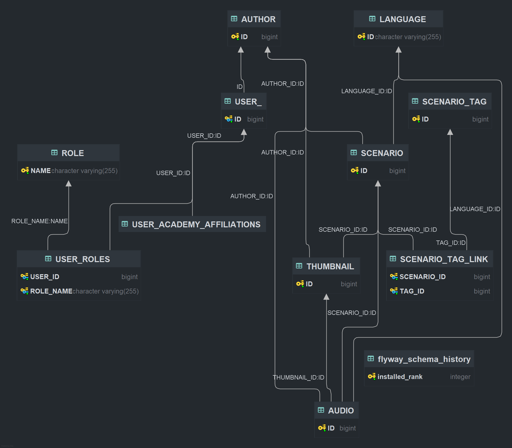

# Conception

## Structure

La structure du projet est la suivante :

````text
.
├── .github/workflows/          # CI and documentation publication workflows
├── docs/                       # Static API documentation published on GitHub Pages
├── src/                        # Spring Boot backend
│   ├── main/java/org/titiplex/
│   │   ├── api/
│   │   ├── bootstrap/
│   │   ├── config/
│   │   ├── persistence/
│   │   └── service/
│   └── main/resources/
├── vite/                       # Vue frontend
│   └── src/
│       ├── api/                # Javascript for API interaction
│       ├── assets/             # Images, fonts, css, etc.
│       ├── components/         # Vue components
│       ├── composables/        # Javascript for Vue components
│       ├── layouts/            # Structure of the page(s)
│       ├── router/             # Website routing
│       ├── styles/             # CSS styles
│       ├── utils/
│       └── views/              # Vue templates
├── pom.xml                     # Maven backend build
└── API_DOCUMENTATION.md        # Notes about API doc generation/publication
````

Le frontend avec **_Vite_** est indépendant, du fait qu'il interagit avec le backend via une API.

## Dépendances

### Données

Les données des langues, visibles sur la page web et importées dans le backend du projet, sont directement tirées
de [Glottolog](https://glottolog.org).

Le fichier _csv_ utilisé peut se trouver
à [cette adresse](https://cdstar.eva.mpg.de//bitstreams/EAEA0-608B-9919-A962-0/glottolog_languoid.csv.zip).
L'ensemble des données Glottolog sont disponibles [ici](https://glottolog.org/meta/downloads), et sont sous
licence [CC-BY-4.0](https://creativecommons.org/licenses/by/4.0/).

## BDD

<div style="text-align: center; align-items: center; align-content: space-around; justify-content: center">
<p style="font-weight: bold; text-decoration: underline">
Schema de la base de données, avec relations de dépendances
</p>
</div>

